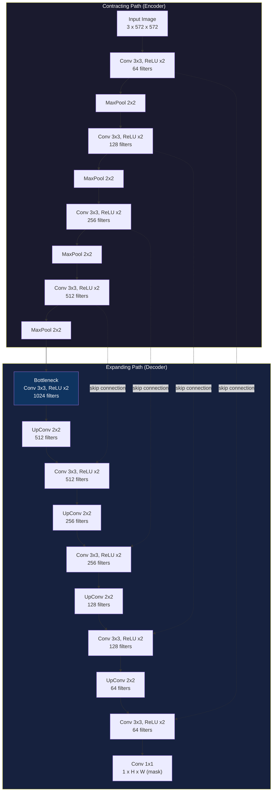

# U-Net for Carvana Image Masking

A PyTorch implementation of **U-Net** for the [Carvana Image Masking Challenge](https://www.kaggle.com/c/carvana-image-masking-challenge) — binary semantic segmentation that separates a car from its background with pixel-level precision.


---

## 📌 Overview

U-Net is a fully convolutional encoder-decoder network originally built for biomedical image segmentation. Its symmetric contracting/expanding path with **skip connections** makes it exceptionally good at producing precise, high-resolution masks — which is exactly what the Carvana challenge needs: crisp car-vs-background masks from studio photos.

This repo trains a U-Net from scratch on the Carvana dataset to predict a binary mask for every pixel in an image.

---

## 🧠 Architecture

U-Net consists of a **contracting path** (encoder) that captures context, and a symmetric **expanding path** (decoder) that enables precise localization. Skip connections concatenate feature maps from the encoder directly into the corresponding decoder stage, preserving fine spatial detail lost during downsampling.



**Key design choices in this implementation:**
- `DoubleConv` blocks: `Conv2d → BatchNorm2d → ReLU`, repeated twice
- Downsampling via `MaxPool2d(2)`, upsampling via `ConvTranspose2d` (or bilinear + conv)
- Skip connections concatenated channel-wise before each decoder `DoubleConv`
- Final `1x1` convolution maps to a single-channel logit map (binary mask)
- Loss: `BCEWithLogitsLoss` + Dice Loss (combined) for better boundary accuracy
- Output activation: `Sigmoid` at inference to get a `[0, 1]` probability mask

---

## 📂 Project Structure

```
unet-carvana/
├── data/
│   ├── train_images/
│   ├── train_masks/
│   ├── val_images/
│   └── val_masks/
├── model.py            # U-Net architecture (DoubleConv, Down, Up, OutConv)
├── dataset.py           # CarvanaDataset (torch Dataset + transforms)
├── train.py              # Training loop, checkpointing, validation
├── utils.py             # Dice score, accuracy, save/load checkpoint, save predictions
├── predict.py            # Run inference on new images
├── requirements.txt
└── README.md
```

---

## ⚙️ Requirements

```
torch>=2.0.0
torchvision>=0.15.0
numpy
pillow
albumentations
tqdm
matplotlib
```

Install with:

```bash
pip install -r requirements.txt
```

---

## 📦 Dataset

1. Download the dataset from the [Kaggle Carvana Image Masking Challenge](https://www.kaggle.com/c/carvana-image-masking-challenge/data).
2. Unzip and arrange it as:

```
data/
├── train_images/   # .jpg car images
├── train_masks/    # .gif binary masks
```

3. The `dataset.py` script handles a train/val split — adjust the `split ratio` and image `resize` dimensions there as needed.

---

## 🚀 Usage

### Train

```bash
python train.py \
  --epochs 20 \
  --batch-size 16 \
  --lr 1e-4 \
  --image-height 160 \
  --image-width 240
```

Checkpoints are saved after every epoch to `checkpoints/`, and the best model (by validation Dice score) is saved separately.

### Predict / Run Inference

```bash
python predict.py --checkpoint checkpoints/best_model.pth --image path/to/car.jpg --output out_mask.png
```

### Resume Training

```bash
python train.py --load-checkpoint checkpoints/best_model.pth
```

---

## 📊 Results

| Metric | Score |
|---|---|
| Validation Dice Score | ~0.99 |
| Validation Pixel Accuracy | ~99.5% |
| Training Time (1x GPU) | ~X min/epoch |

*(Fill in with your actual numbers after training.)*

**Sample prediction:**

```
Input Image  →  Predicted Mask  →  Overlay
   [car.jpg] →   [car_mask.png] →  [car_overlay.png]
```

---

## 🔧 Hyperparameters

| Parameter | Value |
|---|---|
| Optimizer | Adam |
| Learning Rate | 1e-4 |
| Batch Size | 16 |
| Loss Function | BCEWithLogitsLoss (+ Dice) |
| Image Size | 160 × 240 (downscaled for speed) |
| Epochs | 20 |

---

## 📚 References

- Ronneberger, O., Fischer, P., & Brox, T. (2015). *U-Net: Convolutional Networks for Biomedical Image Segmentation.* [arXiv:1505.04597](https://arxiv.org/abs/1505.04597)
- [Carvana Image Masking Challenge — Kaggle](https://www.kaggle.com/c/carvana-image-masking-challenge)

---

## 📝 License

This project is licensed under the MIT License — see the [LICENSE](LICENSE) file for details.
